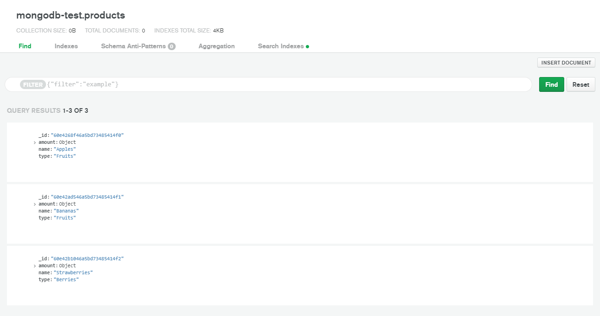

Для разработки базы данных на MongoDB можно использовать MongoDB Cloud.

MongoDB не требует определения схемы документа, что позволяет вносить изменения в структуру документа при добавлении или редактировании данных.

Схема может иметь следующий вид:

```json
{
    name: String,
    type: String,
    amount: {
        number: Number,
        unit: String
    }
}
```



Реализован REST API для выполнения операций CRUD в базе данных MongoDB.

Приложение реализовано с использованием Express, bodyParser, Mongoose.

Реализованы следующие операции:

`GET /products` - получение списка продуктов

`POST /products/new` - добавление нового продукта

`POST /products/update/:id` - обновление информации о продукте по ID

`POST /products/delete/:id` - удаление информации о продукте по ID

При отправке запросов для добавления и обновления продукта информация о нём передаётся в теле POST-запроса.

Сервер возвращает ответ - статус выполнения операции в формате JSON. Пример ответа сервера (добавление данных):

```json
{
    "status": "success"
}
```

Пример ответа сервера на GET-запрос:

```json
[
    {
        "amount": {
            "number": 32,
            "unit": "kg"
        },
        "_id": "60e4268f46a5bd73485414f0",
        "name": "Apples",
        "type": "Fruits"
    },
    {
        "amount": {
            "number": 16.25,
            "unit": "kg"
        },
        "_id": "60e42ad546a5bd73485414f1",
        "name": "Bananas",
        "type": "Fruits"
    },
    {
        "amount": {
            "number": 24.5,
            "unit": "kg"
        },
        "_id": "60e42b1046a5bd73485414f2",
        "name": "Strawberries",
        "type": "Berries"
    }
]
```

Содержимое package.json:

```json
{
  "name": "UnwieldyDoubleSets",
  "version": "1.0.0",
  "description": "",
  "main": "index.js",
  "scripts": {
    "test": "echo \"Error: no test specified\" && exit 1"
  },
  "keywords": [],
  "author": "",
  "license": "ISC",
  "dependencies": {
    "body-parser": "^1.19.0",
    "express": "^4.17.1",
    "mongoose": "^5.13.2"
  }
}
```

Содержимое index.js:

```js
const express = require('express');
const bodyParser = require('body-parser');
const mongoose = require('mongoose');

const app = express();
const urlencodedParser = bodyParser.urlencoded({extended: false});

const Schema = mongoose.Schema;

const productScheme = new Schema({
    name: String,
    type: String,
    amount: {
        number: Number,
        unit: String
    }
});

mongoose.connect("mongodb connection string", { useUnifiedTopology: true, useNewUrlParser: true });

const Product = mongoose.model('products', productScheme);

app.get('/products', (req, res) => {
    void Product.find({}, (err, data) => res.send(data));
})
.post('/products/new', urlencodedParser, (req, res) => {
    const product = new Product(req.body);
    product.save(err => {
        res.send({'status': err ? err : 'success'});
    });
})
.post('/products/update/:id', urlencodedParser, (req, res) => {
    let id = mongoose.Types.ObjectId(req.params.id);
    Product.updateOne({'_id': id}, req.body, (err, result) => {
        res.send({'status': err ? err : 'success'});
    });
})
.post('/products/delete/:id', urlencodedParser, (req, res) => {
    let id = mongoose.Types.ObjectId(req.params.id);
    Product.deleteOne({'_id': id}, (err, result) => {
        res.send({'status': err ? err : 'success'});
    });
});

app.listen();
```
