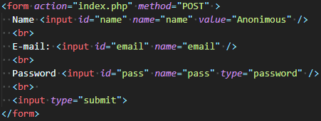
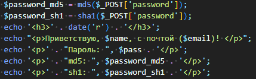
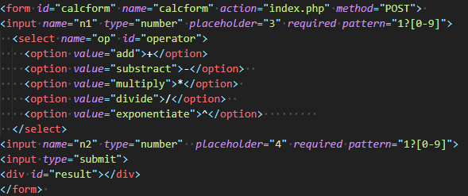
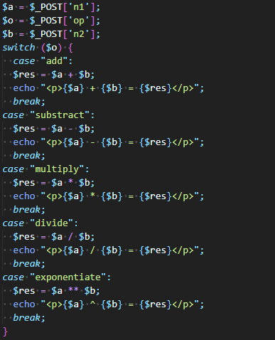

## Цель:

1. Создать приложение, получающее данные через форму, и кодирующее их в MD5 и SHA-1.

2. Создать приложение-калькулятор, получающее данные через форму, и выводящее результаты вычислений на той же странице.

## Код формы, собирающей данные для кодирования:

## Код, отвечающий за кодирование и вывод данных:

## Результаты md5 sh1:


    
    


## Код для асинхронной отправки данных:

## Код формы, получающей данные для вычисления:

## Код, отвечающий за вычисления и вывод данных:

## Калькулятор:


    
    


## Вывод:

В ходе выполнения лабораторной работы были получены навыки работы с языком программирования php и ajax.
Были созданы два приложения:

1. Приложение для кодирования данных.
2. Приложение калькулятор.
