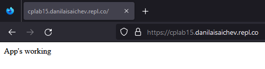
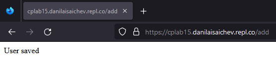
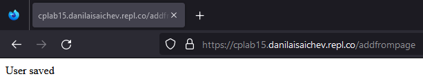

## Цель:

1. Создать Express-приложение, которое по маршруту /add (GET) добавляет в коллекцию users в этой базе данных документ со следующими полями:
   * поле login состоит из слова herzen, знака @ и электронной почты, как она указана в Moodle (herzen@danila.isaichev@mail.ru);
   
   * поле password содержит число, переданное через сообщение в Moodle перед началом занятия (16).

2. Добавить маршрут /addfrompage, который работает аналогично предыдущему, но поле password содержит результат считывания содержимого со страницы http://kodaktor.ru/g/_unsafe/65e39.
3. Осуществить вставку, перейдя по маршруту /add.

## Подключение дополнительных зависимостей и создание необходимых констант (фрагмент index.js):

```js
const m = require('mongoose');
const express = require('express');
const UserModel = require('./user.js');
const http = require('http');

const { URL } = process.env;
const User = UserModel(m);
const app = express();
```

## Обработка маршрутов / и /add (фрагмент index.js):

```js
app

.get('/', (_, res) => {res.send('App\'s working')})

.get('/add', (_, res) => {

  console.log(URL);

  const user = new User({
    name: 'herzen@danila.isaichev@mail.ru',
    password: '16'
  });

  user.save((err, user) => {

    if (err) {
      console.log('Error:', err);
      res.send('Error');
    } else {
      console.log('User saved:', user);
      res.send('User saved');
    }

  });

})
```

## Обработка маршрута /addfrompage (фрагмент index.js):

```js
.get('/addfrompage', (_, res) => {

  http.get('http://kodaktor.ru/g/_unsafe/65e39', (ress) => {

    buffer = '';

    ress.on('data', (data) => (buffer += data));

    ress.on('end', () => {

      const user = new User({
        name: 'herzen@danila.isaichev@mail.ru',
        password: buffer
      });

      user.save((err, user) => {

        if (err) {
          console.log('Error:', err);
          res.send('Error');
        } else {
          console.log('User saved:', user);
          res.send('User saved');
        }

      });
    });
  });
})
```

## Прослушивание запросов (фрагмент index.js):

```js
app.listen(async () => {
    await m.connect(URL, {
      useUSnifiedTopology: true,
      useNewUrlParser: true
    });
});
```

## index.js:

```js
const m = require('mongoose');
const express = require('express');
const UserModel = require('./user.js');
const http = require('http');

const { URL } = process.env;
const User = UserModel(m);
const app = express();

app

.get('/', (_, res) => {res.send('App\'s working')})

.get('/add', (_, res) => {

  console.log(URL);

  const user = new User({
    name: 'herzen@danila.isaichev@mail.ru',
    password: '16'
  });

  user.save((err, user) => {

    if (err) {
      console.log('Error:', err);
      res.send('Error');
    } else {
      console.log('User saved:', user);
      res.send('User saved');
    }

  });

})

.get('/addfrompage', (_, res) => {

  http.get('http://kodaktor.ru/g/_unsafe/65e39', (ress) => {

    buffer = '';

    ress.on('data', (data) => (buffer += data));

    ress.on('end', () => {

      const user = new User({
        name: 'herzen@danila.isaichev@mail.ru',
        password: buffer
      });

      user.save((err, user) => {

        if (err) {
          console.log('Error:', err);
          res.send('Error');
        } else {
          console.log('User saved:', user);
          res.send('User saved');
        }

      });
    });
  });
})

app.listen(async () => {
    await m.connect(URL, {
      useUSnifiedTopology: true,
      useNewUrlParser: true
    });
});
```

## Создание схемы и модели пользователя (user.js):

```js
module.exports = m => {

  const UserSchema = m.Schema({
    login: String,
    password: String
  });

  return m.model('User', UserSchema, 'users');

};
```

## Результаты:







## Вывод:

В ходе выполнения лабораторной работы были получены навыки работы с ORM Mongoose и СУБД MongoDB.

Было создано приложение, обрабатывающее маршруты: /, /add, /addfrompage.


    
    

