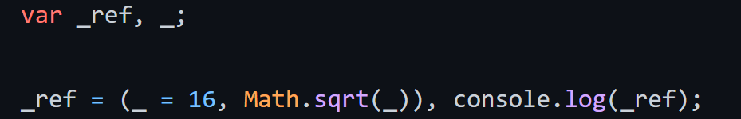
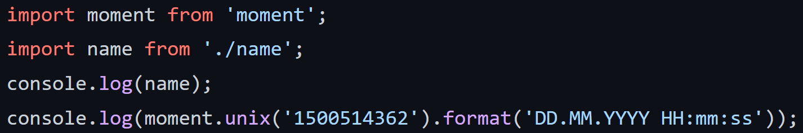
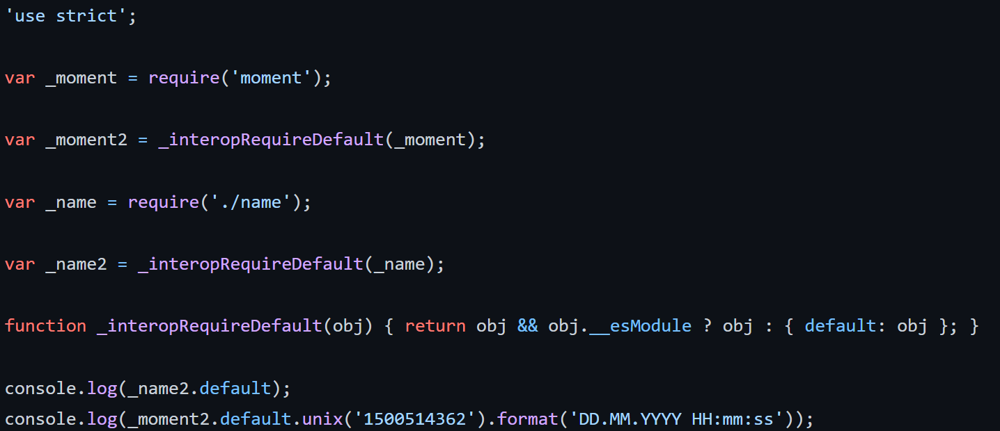
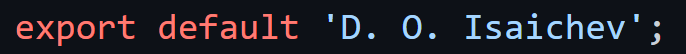

# Отчёт по лабораторным работам 3 и 4

## Цель:

Транспиляция с помощью Babel, развёртывание проекта на JavaScript, включающего модули.

## Файл index.js до выполнения транспиляции:

## Файл index.js после выполнения транспиляции:

## Файл main.js до выполнения транспиляции:

## Файл main.js после выполнения транспиляции:

## Файл name.js до выполнения транспиляции:

## Файл name.js после выполнения транспиляции:

## Вывод:

В ходе выполнения работ были получены навыки работы с транспилятором Babel. Была выполнена транспиляция файлов index.js, main.js, name.js.  


    
    

