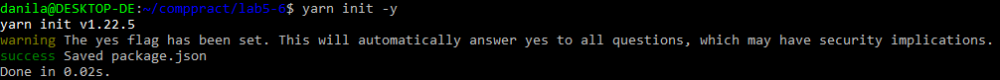
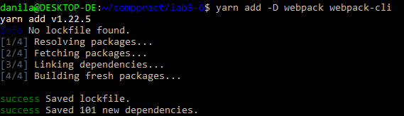
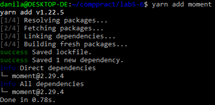
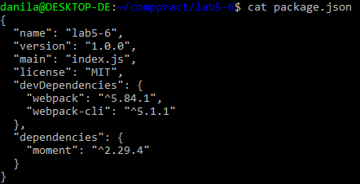
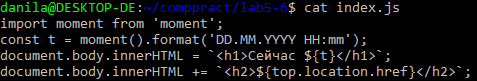
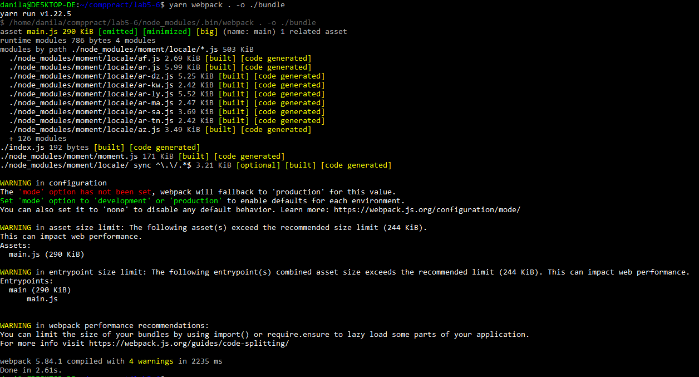

## Цель:

Научиться выполнять сборку проекта с помощью webpack.

## Инициализация проекта:

## Добавление webpack и webpack-cli:

## Добавление moment:

## package.json:

## index.js:

## Сборка:

## README.md:

## Результат:

  


## Вывод:

В ходе выполнения работ были получены сборки проекта с помощью webpack.

## Ссылка на репозиторий:

    

