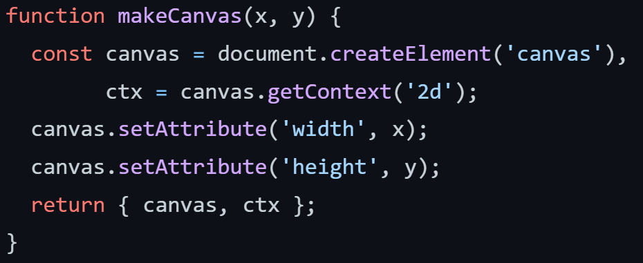
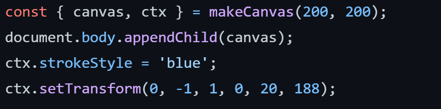
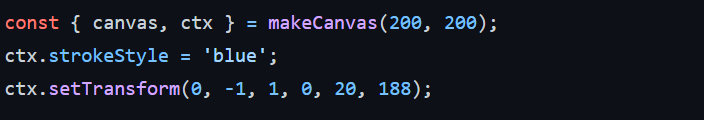
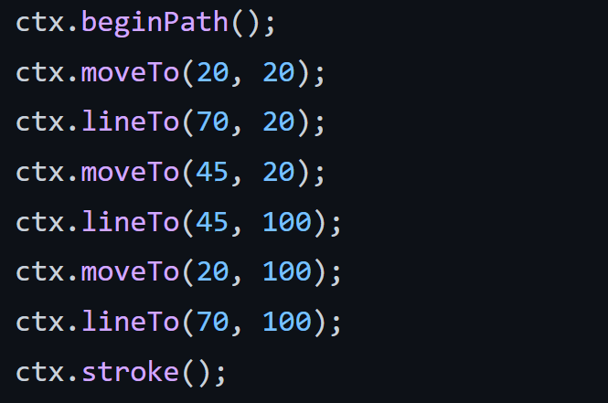
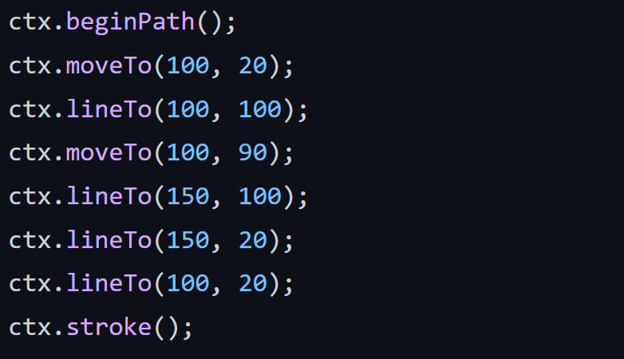
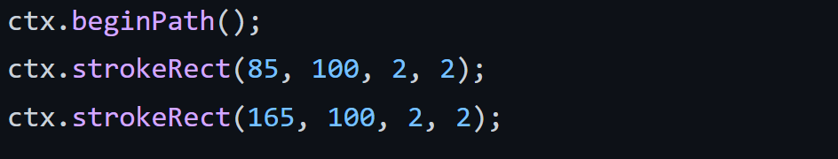
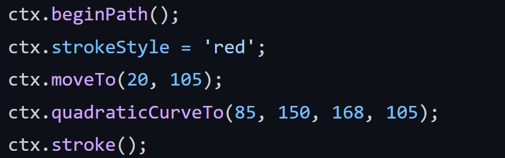
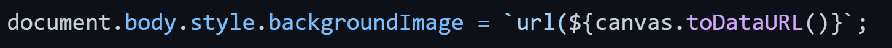

## Цель:

Научиться создавать изображения с помощью JavaScript Canvas API и:

1. Создать страницу с логотипом, повёрнутым на 90
   градусов против часовой стрелки, состоящим из:
   инициалов, записанных в стиле написания
   почтового индекса, и кривой Безье под ними.

2. Создать страницу, на которой полученный
   логотип будет использован, как фоновый узор.

## Функция, отвечающая за создание Canvas'а:

## Фрагмент кода, отвечающий за:

* создание нового Canvas’а;

* добавления его к body;

* установки цвета линий;

* поворот на 90 градусов.

Для страницы с логотипом.

## Фрагмент кода, отвечающий за:

* создание нового Canvas’а;
* добавления его к body;
* установки цвета линий;
* поворот на 90 градусов. 

Для страницы, на которой логотип – фоновый узор.

## Фрагмент кода, отвечающий за написание буквы I:

## Фрагмент кода, отвечающий за написание буквы D:

## Фрагмент кода, отвечающий за написание точек около инициалов:

## Фрагмент кода, отвечающий за рисование кривой Безье:

## Фрагмент кода, отвечающий за установку логотипа в качестве фонового узора:

## Результаты:


  

  



  

  


## Вывод:

В ходе выполнения лабораторной работы были получены навыки работы с JavaScript Canvas API, был создан логотип, были созданы две страницы:

* на одной из них был расположен созданный логотип;
* на другой этот логотип использовался, как фоновый узор.

## Использованные ресурсы:

- https://learn.javascript.ru/url
- https://scriptdev.ru/webapi/canvas/todataurl/
- https://msiter.ru/references/html5-canvas/settransform

## Ссылки на репозитории:

    
    
    

