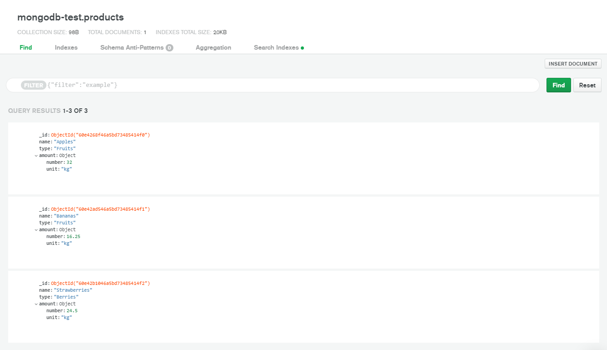

Для разработки базы данных на MongoDB можно использовать MongoDB Cloud.

Этапы разработки базы данных:

* создание базы данных;
* создание коллекций;
* добавление данных.

MongoDB не требует определения схемы документа, что позволяет вносить изменения в структуру документа при добавлении или редактировании данных.

Этапы создания базы данных в MongoDB Cloud:

* создание организации (organization);
* создание проекта (project);
* создание кластера (cluster) и базы данных с помощью MongoDB Atlas;
* добавление данных с помощью MongoDB Atlas, MongoDB Compass или веб-приложения.

