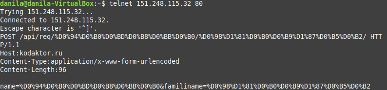

## Моделирование взаимодействия «клиент-сервер» с помощью программы telnet и программы curl

Подготовка данных для отправки запроса:

Данила: 

```bash
%D0%94%D0%B0%D0%BD%D0%B8%D0%BB%D0%B0
```

Исайчев:

```bash
%D0%98%D1%81%D0%B0%D0%B9%D1%87%D0%B5%D0%B2
```

### Отправка запроса с помощью telnet

GET запрос: 
 

Ответ на GET запрос:

 

POST запрос:

 

Ответ на POST запрос:
  

#### Отправка запроса с помощью cURL

GET запрос:
 


Ответ на GET запрос:

 


POST запрос:

 


Ответ на POST запрос:
  

### Создание простого веб-сервера на основе Node.js

Пример ответа сервера:

```
{
  "date": "16.06.2021 18:07:23"
}
```