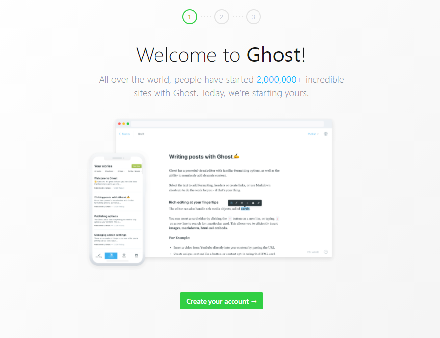

Ghost.js можно установить с помощью Docker-контейнера.

Для установки контейнера необходимо выполнить команду:

```
docker pull ghost
```

Для запуска Ghost необходимо выполнить команду:

```
docker run -d --name some-ghost -e url=http://localhost:3001 -p 3001:2368 ghost
```

После этого Ghost будет доступен по адресу `server_ip:3001`.



