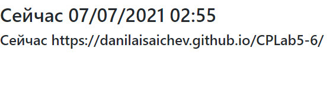

### Тема 1. Сборка проекта с помощью бандлера Webpack

1. Добавление webpack и webpack-cli

```
yarn add -D webpack webpack-cli
```

2. Добавление библиотеки moment

```
yarn add moment
```

3. Сборка проекта

```
yarn webpack . -o ./bundle.js
```



