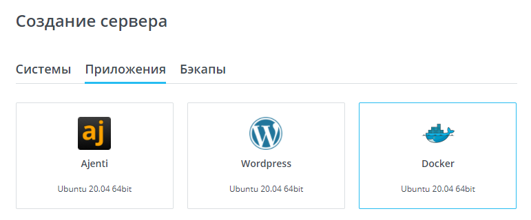
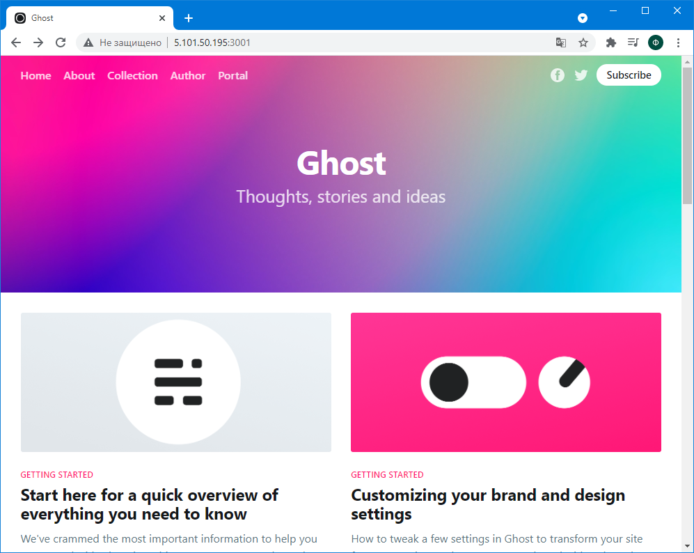
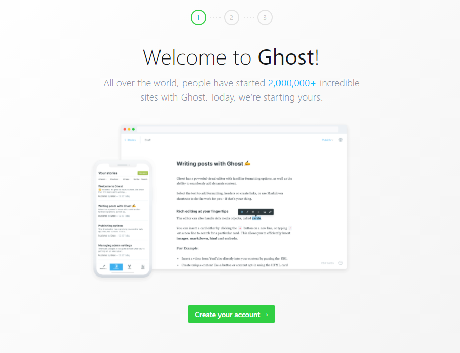

### Тема 4. Развёртывание веб-ресурса на платформе vscale.io с использованием Docker

Для развёртывания веб-ресурса на платформе vscale.io необходимо создать аккаунт.

После создания аккаунта необходимо создать сервер с готовым образом Docker:



После создания сервера необходимо подключиться к нему по SSH с использования логина и пароля или SSH-ключа.

Веб-ресурсом может являться сайт на CMS Ghost.js, которую можно установить с помощью Docker-контейнера.

Для установки контейнера необходимо выполнить команду:

```
docker pull ghost
```

Для запуска Ghost необходимо выполнить команду:

```
docker run -d --name some-ghost -e url=http://localhost:3001 -p 3001:2368 ghost
```

После этого Ghost будет доступен по адресу `server_ip:3001`.



Панель администратора доступна по адресу `server_ip:3001/ghost`.

