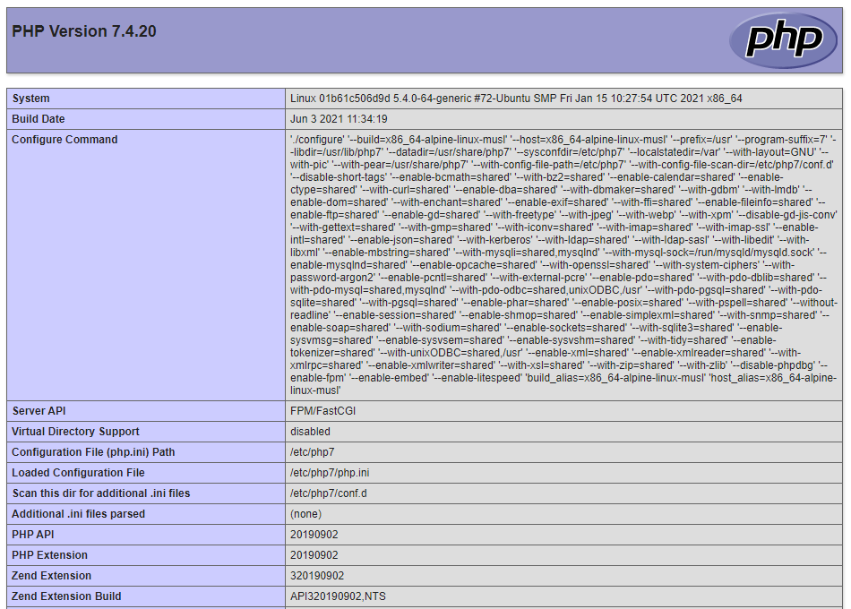
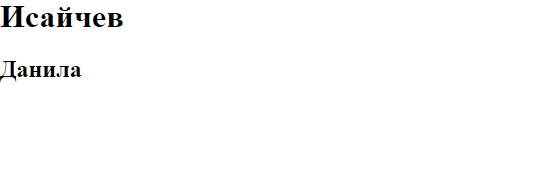

### Тема 2. Использование серверных веб-технологий на платформе PHP

#### I. Развёртывание стека LAMP

Часть I. Развёртывание PHP/FPM + NGINX

Часть II

#### II. Разработка на PHP с помощью GD2 графического интерфейса визуализации данных, полученных с помощью сетевого интерфейса

