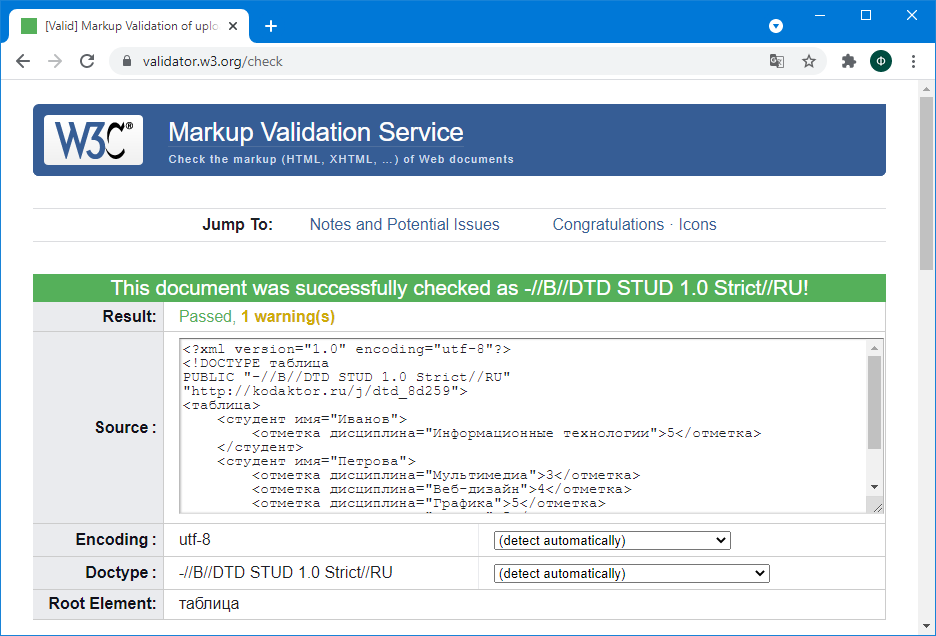

### Тема 1. Языковые средства веб-технологий на основе XML и CSS и развёртывание среды разработки компонентов аппаратно-программных комплексов

1. Представьте свои текущие знания в области HTML в виде набора тегов (правильно сформированного XML-документа)
2. Осуществите рефакторинг DTD для данного документа, уменьшив количество повторяющихся инструкций

[XML-документ](competencies.xml)

[DTD](competencies.dtd)

3. Рассмотрите документ Статистика посещений страницы (https://kodaktor.ru/g/08092017_stats). Основываясь на нём, разработайте язык для описания посещений некоторого URL, т.е. создайте DTD и валидный документ.

[XML-документ](stats.xml)

[DTD](stats.dtd)

3. Разработайте или сгенерируйте схему (XML Schema) для документа и осуществите её валидацию с помощью инструмента типа xmlvalidation.com.

[XML-документ](students.xml)

[DTD](students.xml)

Валидация документа:

