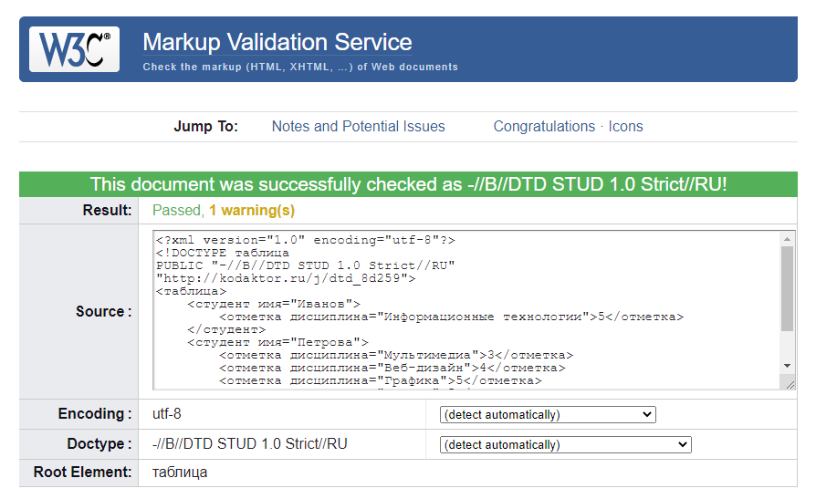

### Тема 1. Экспериментальная проверка корректности документов (валидация) на языках разметки

Валидация XML-документов позволяет проверить, что документ является синтаксически верным (правильно сформированным, well-formed) и валидным относительно определённой структуры (схемы).

Схема документа - DTD (Document Type Definition).

Проверка синтаксиса и валидация относительно DTD может быть произведена с помощью сервиса валидации W3C: https://validator.w3.org/.

