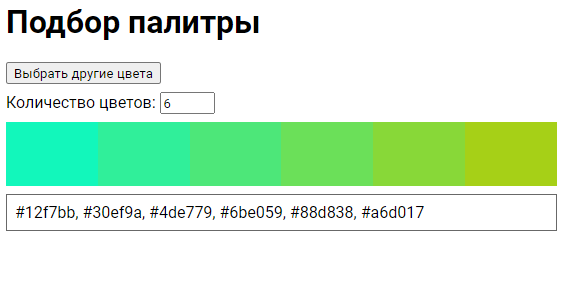

### Тема 3. Проектирование сценария для подбора цветового оформления веб-документа

Сценарий реализован с использованием библиотеки [chroma.js](https://gka.github.io/chroma.js/).

Шкала показывается от двух случайно выбранных цветов, которые генерируются с помощью метода `chroma.random()`. Для создания шкалы используется метод `chroma.scale(colors)`.

