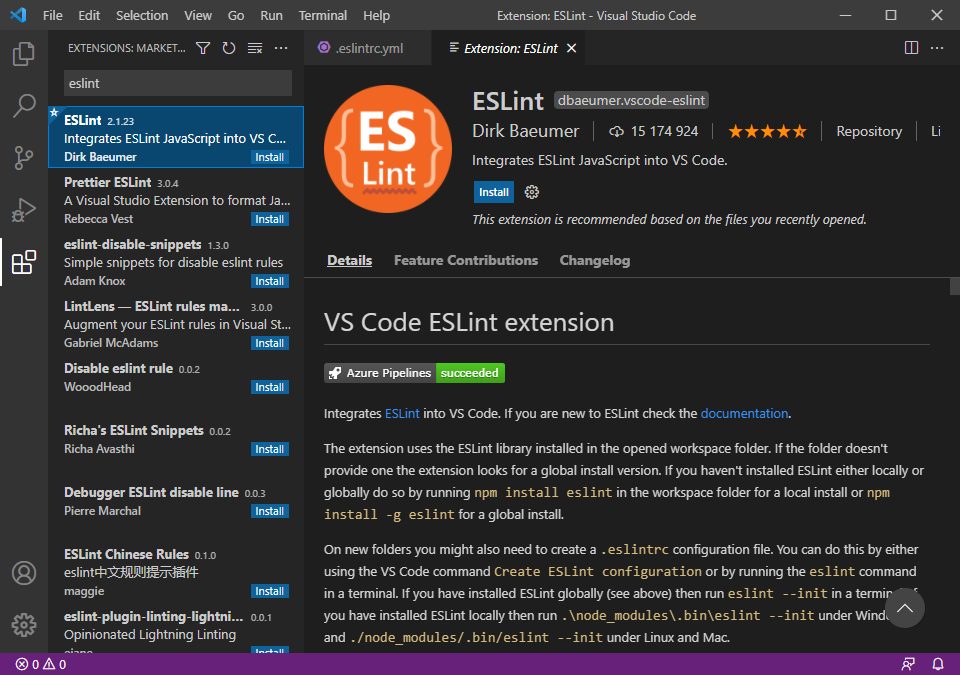
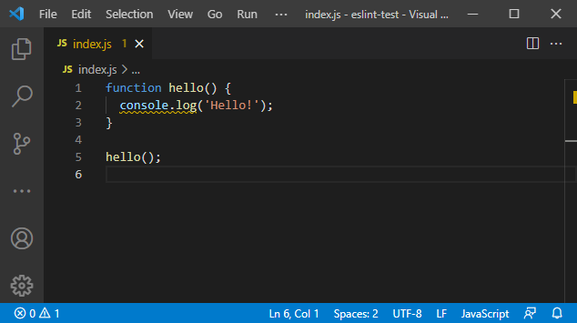

### Тема 4. Подготовка материалов для выступления по настройке линтера кода

ESLint - это статический анализатор кода, который может находить синтаксические ошибки, баги и неточности форматирования.

Для работы ESLint необходимо установить Node.js и npm.

Настройка линтера eslint для Visual Studio Code:

1. Установка eslint

```
npm install -D eslint
```

2. Установка плагинов eslint

```
npm install -D eslint-config-airbnb-base eslint-plugin-import
```

3. Создание конфигурационного файла .eslintrc.yml

```yaml
extends:
  - 'airbnb-base'
env:
  node: true
  browser: true
```

4. Установка плагина ESLint




Исправление кода с учётом рекомендаций линтера:




