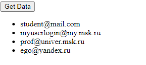

### Тема 3. Разработка приложения для асинхронного считывания данных из JSON и вывода в веб-документ путём нативной модификации дерева DOM
Данные JSON получены по адресу https://kodaktor.ru/j/users.

Данные считываются с помощью fetch. Модификация дерева DOM происходит путём вызова функции appendChild.

Скриншот приложения:



Код приложения (фрагмент script):
```javascript
document.querySelector('#btn').onclick = async () => {
    let response = await fetch('https://kodaktor.ru/j/users');
    data = await response.json();
    data.users.forEach(user => {
        let ul = document.querySelector('#users');
        let li = document.createElement('li');
        li.appendChild(document.createTextNode(user.login));
        ul.appendChild(li);
    });
}
```

